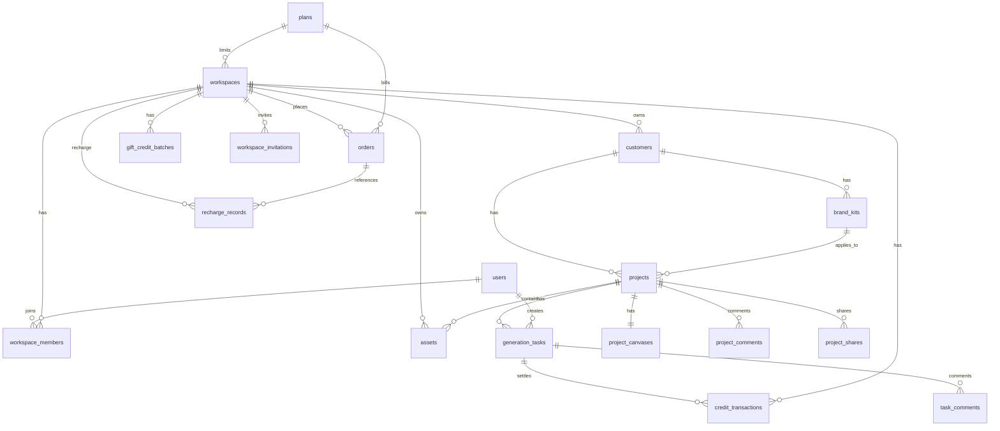

# 数据库ERD

## 总体实体关系

在 Go 业务分站中，移除了所有与大模型渠道直接关联的网关底层表（这些已在 12ZX-AI 中管理），引入了 `client_settings` 用于分站的网关密钥配置：



---

## 核心业务表 DDL 定义 (PostgreSQL / SQLite 兼容)

### 1. users
```sql
users (
  id uuid primary key,
  email varchar(255) unique,
  phone varchar(32),
  display_name varchar(100),
  avatar_url text,
  status varchar(32) not null default 'active',
  created_at timestamptz not null default now(),
  updated_at timestamptz not null default now()
)
```

### 2. workspaces
```sql
workspaces (
  id uuid primary key,
  name varchar(120) not null,
  owner_user_id uuid references users(id),
  plan_id uuid references plans(id),
  recharge_balance bigint not null default 0,
  gift_balance bigint not null default 0,
  refund_balance bigint not null default 0,
  storage_quota bigint not null default 0,
  created_at timestamptz not null default now(),
  updated_at timestamptz not null default now()
)
```

### 3. workspace_members
```sql
workspace_members (
  id uuid primary key,
  workspace_id uuid references workspaces(id) on delete cascade,
  user_id uuid references users(id) on delete cascade,
  role varchar(32) not null,
  daily_credit_limit bigint,
  monthly_credit_limit bigint,
  status varchar(32) not null default 'joined',
  joined_at timestamptz not null default now()
)
```

### 4. customers
```sql
customers (
  id uuid primary key,
  workspace_id uuid references workspaces(id) on delete cascade,
  name varchar(160) not null,
  industry varchar(100),
  contact_name varchar(100),
  contact_info jsonb,
  notes text,
  created_at timestamptz not null default now(),
  updated_at timestamptz not null default now()
)
```

### 5. brand_kits
```sql
brand_kits (
  id uuid primary key,
  workspace_id uuid references workspaces(id) on delete cascade,
  customer_id uuid references customers(id) on delete set null,
  name varchar(160) not null,
  logo_asset_id uuid,
  colors jsonb,
  fonts jsonb,
  tone_of_voice text,
  visual_keywords jsonb,
  forbidden_words jsonb,
  style_prompt text,
  notes text,
  created_at timestamptz not null default now(),
  updated_at timestamptz not null default now()
)
```

### 6. projects
```sql
projects (
  id uuid primary key,
  workspace_id uuid references workspaces(id) on delete cascade,
  customer_id uuid references customers(id) on delete set null,
  brand_kit_id uuid references brand_kits(id) on delete set null,
  name varchar(180) not null,
  brief text,
  target_platforms jsonb,
  status varchar(32) not null default 'draft',
  budget_credits bigint,
  consumed_credits bigint not null default 0,
  due_at timestamptz,
  created_by uuid references users(id) on delete set null,
  created_at timestamptz not null default now(),
  updated_at timestamptz not null default now()
)
```

### 7. assets
```sql
assets (
  id uuid primary key,
  workspace_id uuid references workspaces(id) on delete cascade,
  project_id uuid references projects(id) on delete cascade,
  customer_id uuid references customers(id) on delete set null,
  asset_type varchar(32) not null,
  source varchar(32) not null,
  file_url text not null,
  thumbnail_url text,
  metadata jsonb,
  created_by uuid references users(id) on delete set null,
  created_at timestamptz not null default now()
)
```

### 8. generation_tasks
```sql
generation_tasks (
  id uuid primary key,
  workspace_id uuid references workspaces(id) on delete cascade,
  project_id uuid references projects(id) on delete cascade,
  user_id uuid references users(id) on delete set null,
  task_type varchar(64) not null,
  input_payload jsonb not null,
  output_payload jsonb,
  selected_model varchar(160),
  upstream_task_id varchar(120),  -- 12ZX-AI 的异步任务 ID，用于协程状态轮询
  estimated_credits bigint not null default 0,
  frozen_credits bigint not null default 0,
  frozen_gift_credits bigint not null default 0,
  frozen_recharge_credits bigint not null default 0,
  frozen_refund_credits bigint not null default 0,
  actual_credits bigint not null default 0,
  upstream_cost_credits bigint not null default 0,  -- 站长调用主网关实际扣减的额度
  status varchar(32) not null default 'pending',
  error_code varchar(80),
  error_message text,
  idempotency_key varchar(120),
  created_at timestamptz not null default now(),
  started_at timestamptz,
  completed_at timestamptz
)
```

### 9. credit_transactions
```sql
credit_transactions (
  id uuid primary key,
  workspace_id uuid references workspaces(id) on delete cascade,
  user_id uuid references users(id) on delete set null,
  project_id uuid references projects(id) on delete set null,
  task_id uuid references generation_tasks(id) on delete set null,
  transaction_type varchar(32) not null,
  amount bigint not null,
  gift_amount bigint not null default 0,
  recharge_amount bigint not null default 0,
  refund_amount bigint not null default 0,
  balance_after bigint not null,
  reason text,
  operator_id uuid references users(id) on delete set null,
  created_at timestamptz not null default now()
)
```

### 10. audit_logs
```sql
audit_logs (
  id uuid primary key,
  workspace_id uuid references workspaces(id) on delete cascade,
  operator_id uuid references users(id) on delete set null,
  action varchar(120) not null,
  target_type varchar(80),
  target_id uuid,
  before_snapshot jsonb,
  after_snapshot jsonb,
  ip inet,
  user_agent text,
  created_at timestamptz not null default now()
)
```

### 11. client_settings
```sql
client_settings (
  id uuid primary key,
  upstream_api_url varchar(255) not null,   -- 主网关 API 根路径
  upstream_api_key text not null,          -- 站长的授权令牌
  allow_user_register boolean not null default true,
  gift_credits_on_register bigint not null default 0,
  price_rate numeric(4,2) not null default 1.00,  -- 对散客积分定价的加价率
  created_at timestamptz not null default now(),
  updated_at timestamptz not null default now()
)
```

---

## 商业化与协作表

### 12. plans
```sql
plans (
  id uuid primary key,
  name varchar(100) not null,
  price_cents bigint not null default 0,
  monthly_credits bigint not null default 0,
  max_members integer not null default 1,
  storage_quota_bytes bigint not null default 0,
  features jsonb not null default '{}'::jsonb,
  enabled boolean not null default true,
  created_at timestamptz not null default now(),
  updated_at timestamptz not null default now()
)
```

### 13. orders
```sql
orders (
  id uuid primary key,
  workspace_id uuid not null references workspaces(id) on delete cascade,
  plan_id uuid references plans(id) on delete set null,
  amount_cents bigint not null default 0,
  payment_provider varchar(64) not null,
  status varchar(32) not null default 'pending',
  created_at timestamptz not null default now(),
  updated_at timestamptz not null default now()
)
```

### 14. recharge_records
```sql
recharge_records (
  id uuid primary key,
  workspace_id uuid not null references workspaces(id) on delete cascade,
  order_id uuid references orders(id) on delete set null,
  credits_added bigint not null,
  recharge_type varchar(32) not null,
  operator_id uuid references users(id) on delete set null,
  created_at timestamptz not null default now()
)
```

### 15. gift_credit_batches
```sql
gift_credit_batches (
  id uuid primary key,
  workspace_id uuid not null references workspaces(id) on delete cascade,
  amount bigint not null,
  remaining_amount bigint not null,
  expired_at timestamptz not null,
  created_at timestamptz not null default now()
)
```

### 16. workspace_invitations
```sql
workspace_invitations (
  id uuid primary key,
  workspace_id uuid not null references workspaces(id) on delete cascade,
  email varchar(120) not null,
  role varchar(32) not null,
  token text not null,
  status varchar(32) not null default 'pending',
  invited_by uuid references users(id) on delete set null,
  created_at timestamptz not null default now(),
  expires_at timestamptz not null
)
```

### 17. project_canvases
```sql
project_canvases (
  project_id uuid primary key references projects(id) on delete cascade,
  workspace_id uuid not null references workspaces(id) on delete cascade,
  canvas jsonb not null default '{"version":1,"items":[]}'::jsonb,
  updated_by uuid references users(id) on delete set null,
  created_at timestamptz not null default now(),
  updated_at timestamptz not null default now()
)
```

### 18. project_comments
```sql
project_comments (
  id uuid primary key,
  project_id uuid not null references projects(id) on delete cascade,
  user_id uuid references users(id) on delete cascade,
  client_name varchar(80),
  content text not null,
  created_at timestamptz not null default now()
)
```

### 19. task_comments
```sql
task_comments (
  id uuid primary key,
  task_id uuid not null references generation_tasks(id) on delete cascade,
  user_id uuid not null references users(id) on delete cascade,
  content text not null,
  created_at timestamptz not null default now()
)
```

### 20. project_shares
```sql
project_shares (
  id uuid primary key,
  project_id uuid not null references projects(id) on delete cascade,
  token varchar(128) unique not null,
  created_by uuid references users(id) on delete set null,
  created_at timestamptz not null default now(),
  expires_at timestamptz,
  status varchar(32) not null default 'active'
)
```
